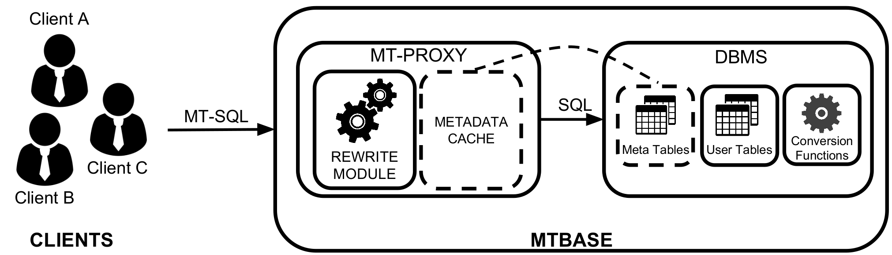

# MTBase Project Overview

MTBase is a project at Systems Group, Department of Computer Science, ETH
Zurich. It enables cross-tenant query processing on regular DBMS systems with a
language called MTSQL. MTSQL extends SQL with addititional syntax and semantics
for multi-tenant datbases. Please find out more about MTSQL and MTBase by
reading our [white paper](extended.pdf).

## About MTBase

MTBase is a system that executes MTSQL. At its core it is a middleware (proxy)
sitting between a client and any DBMS of choice. The query rewrite module
`mt-rewrite` was written in Haskel and can be found
[here](https://github.com/lucasbraun/mt-rewrite). The performance of MTBase was
evaluated using the MT-H benchmark (described next).

## Publications
* [MTBase White Paper](extended.pdf)

## About MT-H
The MT-H benchmark is a modified version of the TPC-H benchmark H to measure
the performance of Cross-Tenant Query Processing in MTSQL processing engines.

MT-H was used to evaluate MTBase using [MT-H
dbgen](https://github.com/mtbase/mt-h) for data generation, a couple of [SQL
scripts](https://github.com/mtbase/sql-scripts) for data and schema loading and
a couple of [Python scripts](https://github.com/mtbase/python-scripts) to
rewrite and execute the queries. Queries were rewritten with
[MT-Rewite](https://github.com/lucasbraun/mt-rewrite) and the systems under
test were MTBase-on-PostgreSQL and MTBase-on-System-M. While the scripts for
MTBase-on-PostgreSQL are open-source (in the SQL/Python scripts projects),
System-M is a commercial system and scrpts for running the cannot be made
publicly available for licencsing reasons. The evalation results can be found
in the [MTBase white paper](extended.pdf).

## Evaluation of MTBase with MT-H
If you would like to evaluate MTBase-on-PostgreSQL or MTBase-on-MySQL with
MT-H, follow these steps:
1. Download, compile and execute the [MT-H data
   generator](https://github.com/mtbase/mt-h).
2. Use the [SQL scripts](https://github.com/mtbase/sql-scripts) to create the
   MT-H schema and load the generated data into your datbase of choice (MySQL
   or PostgreSQL).
3. Download and execute [MT-Rewrite](https://github.com/lucasbraun/mt-rewrite).
4. Configure the [Python scripts](https://github.com/mtbase/python-scripts) to
   point to your database and to MT-Rewrite.
5. Rewrite, (validate), and execute the MT-H benchmark queries using these
   scripts. The scripts measure time, report results and can also be used to
   summarize different runs with different parameters.
